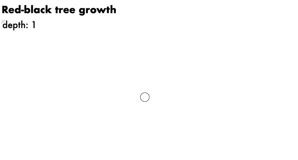
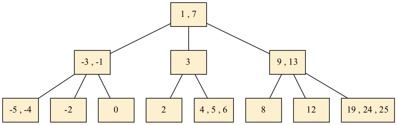

# Introduction to data structures and algorithms

This repo aims to provide minimalist implementations of data structures and algorithms in Python. The bare necessities. Each data structure is accompanied by a video lecture (and pdf slides).

## Data structures

### Hash Tables

- :movie_camera: [video lecture](https://www.youtube.com/watch?v=r1XZGP5ppqQ)
- :bar_chart: [slides (pdf)](https://samuelalbanie.com/files/digest-slides/2022-09-brief-guide-to-hash-tables.pdf)
- :hammer: [hash_table.py](hash_table.py)
- :fountain_pen: [detailed references](https://samuelalbanie.com/digests/2022-09-brief-guide-to-hash-tables/)

### Binary Search Trees

- :movie_camera: [video lecture](https://youtu.be/0woI8l0ZWmA)
- :bar_chart: [slides (pdf)](https://samuelalbanie.com/files/digest-slides/2022-10-brief-guide-to-binary-search-trees.pdf)
- :hammer: [binary_search_tree.py](binary_search_tree.py)
- :fountain_pen: [detailed references](https://samuelalbanie.com/digests/2022-10-brief-guide-to-binary-search-trees/)

### Red-Black Trees

- :movie_camera: [video lecture](https://youtu.be/t-oiZnplv7g)
- :bar_chart: [slides (pdf)](https://samuelalbanie.com/files/digest-slides/2022-12-brief-guide-to-red-black-trees.pdf)
- :hammer: [red_black_tree.py](red_black_tree.py)
- :hammer: [script.js (D3 visualisation)](visualisations/script.js)
- :fountain_pen: [detailed references](https://samuelalbanie.com/digests/2022-12-brief-guide-to-red-black-trees/)

### B-trees

- :movie_camera: [video lecture](https://youtu.be/7MqaHGWRS3E)
- :bar_chart: [slides (pdf)](https://samuelalbanie.com/files/digest-slides/2022-12-brief-guide-to-b-trees.pdf)
- :hammer: [btree.py](btree.py) ([visualisation of outputs](graphviz-walkthroughs/btree.md))
- :fountain_pen: [detailed references](http://samuelalbanie.com/digests/2022-12-brief-guide-to-b-trees)

## Heapsort and Binary Heaps

- :movie_camera: [video lecture](https://youtu.be/ryRfapIQHW0)
- :bar_chart: [slides (pdf)](https://samuelalbanie.com/files/digest-slides/2022-12-brief-guide-to-heapsort-and-binary-heaps.pdf)
- :hammer: [heapsort.py](heapsort.py) (related topic: [priority_queue_with_heap.py](priority_queue_with_heap.py))
- :fountain_pen: [detailed references](http://samuelalbanie.com/digests/2022-12-brief-guide-to-heapsort-and-binary-heaps)


## Related concepts

### Big O notation (and its companions)

- :movie_camera: [video lecture](https://www.youtube.com/watch?v=nsIQyK4Gf48)
- :bar_chart: [slides (pdf)](https://samuelalbanie.com/files/digest-slides/2022-10-big-o-notation-and-its-companions.pdf)
- :fountain_pen: [detailed references](https://samuelalbanie.com/digests/2022-10-big-o-notation-and-its-companions/)

### Foundation models for code

Until recently, code for implementing data structures was largely written by hand. As of 2021, there have been exploratory efforts to employ neural networks for the task of generating code from natural language descriptions (this approach underpins the GitHub Copilot tool, for example). If you'd like to learn more, the video below describes Codex, a popular foundation model for code generation.

- :movie_camera: [YouTube video](https://www.youtube.com/watch?v=Wc7dcwF7QaA)
- :bar_chart: [slides (pdf)](https://samuelalbanie.com/files/digest-slides/2022-07-codex.pdf)
- :page_facing_up: [arxiv paper](https://arxiv.org/abs/2107.03374)
- :fountain_pen: [detailed references](https://samuelalbanie.com/digests/2022-07-codex/)

## Further resources

### Books

The books below represent (in my opinion) particularly high-quality learning reference/materials. If you have a local library, it's worth checking in case they have a copy.

- :orange_book: [Introduction to Algorithms (4th Ed.)](https://mitpress.mit.edu/9780262046305/introduction-to-algorithms/) by Thomas H. Cormen et al.  This book was the primary reference/inspiration used when developing the materials above.
- :orange_book: [The Art of Computer Programming](https://www-cs-faculty.stanford.edu/~knuth/taocp.html) by Donald E. Knuth.

### Further open-source books/code

- :green_book: [algorithms.wtf](http://algorithms.wtf/) by Jeff Erickson
- :green_book: + :hammer: [Elementary Algorithms](https://github.com/liuxinyu95/AlgoXY) by Liu Xinyu
- :green_book: + :hammer: [A First Course on Data Structures in Python & the ds2 library](https://github.com/donsheehy/datastructures) by Don Sheehy
- :green_book: + :hammer: [Problem Solving with Algorithms and Data Structures using Python (book & code)](https://runestone.academy/ns/books/published/pythonds/index.html) by Brad Miller and David Ranum

### Visualisations

#### Red-black trees


#### B-trees



## Requirements for install

To visualise the trees, you'll need to have a copy of pygraphviz:

```bash
conda install -c anaconda graphviz
pip install pygraphviz
```

## Additional comments

The repo is a work in progress. It aims to provide a reference for learning, not code for production (it has not been extensively tested to handle all edge cases). Pull requests are welcome.
