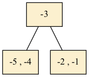

# B-tree script outputs

This file lists the expected outputs of running the `btree.py` script.
It may be useful if you have trouble installing `graphviz` and/or `pygraphviz`.

We run the script as follows:

```bash
python btree.py --viz
```

This should produce the following:

```rst
Keys to be inserted:
[5, 3, 2, 7, 1, 8, 9, 12, 13, 4, 0, 6, -1, 19, 24, 25, -2, -3, -4, -5]
Inorder traversal
-5 -4 -3 -2 -1 0 1 2 3 4 5 6 7 8 9 12 13 19 24 25
Preorder traversal
1 7 -3 -1 -5 -4 -2 0 3 2 4 5 6 9 13 8 12 19 24 25
Postorder traversal
-5 -4 -2 0 -3 -1 2 4 5 6 3 8 12 19 24 25 9 13 1 7
Saving visualisation to figs/btree.png
```


```rst
Keys to be deleted:
[2, 5, 6, 7, 0, 1, 3, 4, 8, 9, 12, 13, 19, 24, 25]
Saving visualisation to figs/btree-after-deletions.png
```


```rst
Print out minimum and maximum values
Minimum key: -5
Maximum key: -1
```
